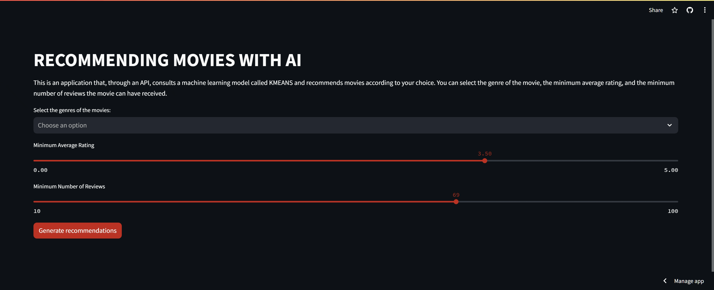

API Recomendação de Filmes
==============================



> :construction: Projeto em construção :construction:

Este projeto é o desenvolvimento de um API que faz a recomendação de filmes através de um modelo de machine learning (KMEANS).


Acesse o link a seguir para experimentar a aplicaçõa rodando: [https://mlops-cliente.onrender.com/](https://mlops-cliente.onrender.com/)


Detalhes de desenvolvimento
==============================

A frontend e servido na porta 3000

A API é servida na porta 5000 e contém 2 endpoints:

 - `/` -> Endpoint principal que informa se a aplicação está rodando.
 - `/api/recommender_movie/` -> Endpoint que aceita requisições do tipo POST e retorna um JSON com os filmes recomendados.

As requisições são passadas no formato JSON no seguinte modelo:

```python
str_json = {
    'generos':['Comedy', 'Romance'], # Lista com os generos que podem ser recomendados
    'n_min_aval':50, # Quantidades minima de notas que os filmes receberam
    'rating_min_aval':3 # Avaliação média mínima que os filmes receberam
}
```

Os generos possíveis são: 
```python
['Action', 'Adventure', 'Animation', 'Children',
        'Comedy', 'Crime', 'Documentary', 'Drama', 'Fantasy', 'Film-Noir',
        'Horror', 'IMAX', 'Musical', 'Mystery', 'Romance', 'Sci-Fi', 'Thriller',
        'War', 'Western']
```

> Defina seu usuario e sua senha no arquivo `.env`

Para rodar, digite no terminal:

`docker compose up`

É possivel visualizar um teste da API em: notebooks/Teste API.ipynb

Projeto
------------

    ├── LICENSE
    ├── README.md           <- The top-level README for developers using this project.
    ├── data
    │   └── processed       <- The final, canonical data sets for modeling.
    │
    ├── models              <- Trained and serialized models, model predictions, or model summaries
    │
    ├── notebooks           <- Jupyter notebooks.
    │
    ├── requirements.txt    <- The requirements file for reproducing the analysis environment, e.g.
    │                         generated with `pip freeze > requirements.txt`
    │
    ├── src                 <- Source code for use in this project.
    │   │
    |   ├── api             <- Scripts to run API
    │   └── app             <- Scripts to run frontend application
    │
    └── docker-compose.yaml <- docker compose file to build and run application


--------

<p><small>Project based on the <a target="_blank" href="https://drivendata.github.io/cookiecutter-data-science/">cookiecutter data science project template</a>. #cookiecutterdatascience</small></p>
